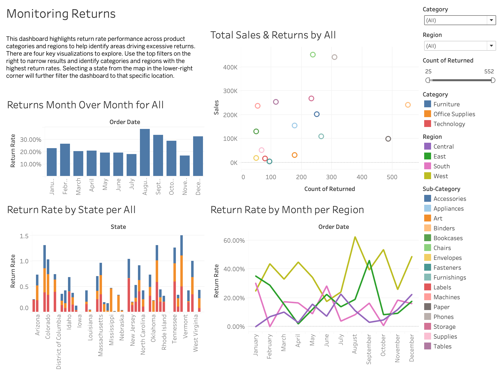
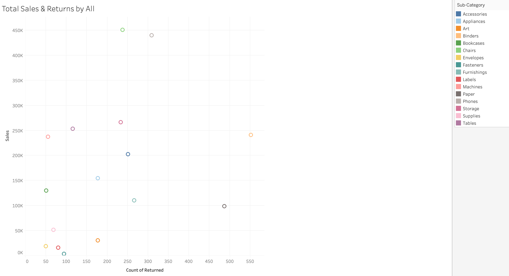
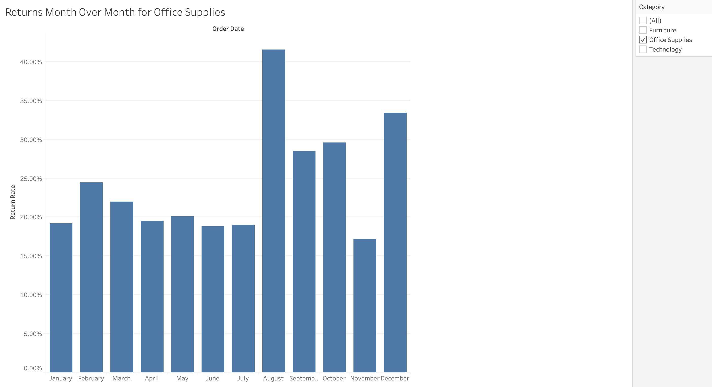
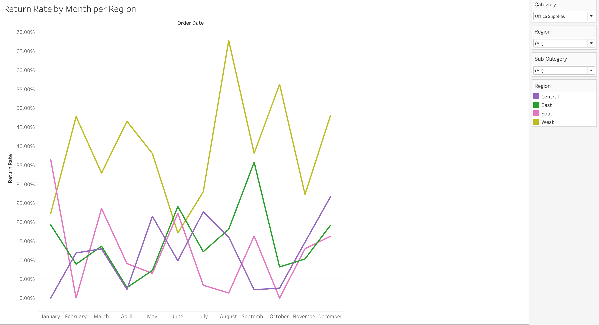
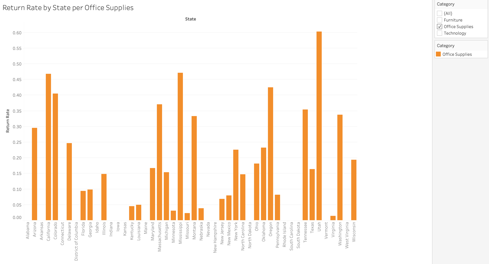

# Monitoring Returns for Superstore 
By Karina Bautista 

## Project Overview
A visual analysis of return rates, sales performance, and regional trends to identify patterns in product returns and support data-driven business decisions.

## Tableau Public Link
View my dashboard here: https://public.tableau.com/views/Sprint5Project_17713552686020/MonitoringReturns?:language=en-US&publish=yes&:sid=&:redirect=auth&:display_count=n&:origin=viz_share_link

## Key Metric: Return Rate
Returns are measured using return rate (units returned ÷ units sold) to allow for fair comparison across products, categories, and regions regardless of sales volume.

While total returns provide helpful context, return rate is the most effective metric for identifying underperforming products and potential customer dissatisfaction.

Higher return rates may indicate:

- Product quality issues
- Misleading or unclear product descriptions
- Shipping or handling damage
- Mismatch between product and customer expectations

## Total Sales & Returns by Sub-Category

There is no clear relationship between sales volume and return rate, meaning high-selling products are not always the ones driving returns.

The highest-risk areas are sub-categories with both strong sales and elevated return rates, as they create the greatest financial and operational impact.

## Return Rates Month Over Month
Return rates show a noticeable increase of approximately 20% in August, primarily driven by the Office Supplies category.

This spike may suggest:

- Seasonal demand patterns
- Increased promotional activity
- Operational strain during higher sales periods

Even short-term increases in return rate can impact profitability due to reverse logistics and lost revenue.

## Return Rate by Month per Region
The West Coast consistently shows higher return rates, especially within Office Supplies.

This pattern may indicate:

- Shipping or fulfillment challenges
- Longer delivery times
- Regional differences in customer expectations or product usage

While this suggests a logistics-related issue, further analysis would be needed to confirm the root cause.

## Return Rate by State per Category
California and Oregon have the highest overall return rates, reinforcing the regional trend seen in the West.

Additionally:

- Office Supplies is the most returned category across multiple states
- States like Mississippi and Nebraska also show elevated returns in this category

These patterns suggest that returns may be driven by a mix of product-specific issues and regional factors.

## Conclusions & Recommendations

This analysis shows that returns are not evenly distributed across the business. Certain categories, time periods, and regions contribute more heavily to return activity.

Office Supplies stands out as a key driver of return rate increases, including a significant spike in August. At the same time, the West Coast—particularly California and Oregon—consistently shows higher return rates, pointing to potential regional or logistical challenges.

From a business perspective, returns directly impact profitability through lost revenue, additional handling costs, and inventory inefficiencies. Focusing on the highest-impact areas can help reduce both costs and customer dissatisfaction.

**Recommendations**

**Investigate high-return subcategories (Office Supplies):**
Identify specific products contributing to returns and evaluate potential issues such as quality, packaging, or unclear product descriptions.

**Analyze the August return spike:**
Review seasonal trends, promotions, and fulfillment processes during this period to determine what may have caused the increase.

**Evaluate West Coast shipping and fulfillment:**
Assess delivery timelines, handling processes, and regional logistics to identify potential causes of higher return rates.

**Prioritize high-impact products:**
Focus on items with both high sales volume and high return rates, as they represent the greatest opportunity for cost reduction.

**Improve customer expectations:**
Enhance product descriptions, images, and details to reduce mismatches between what customers expect and what they receive.
