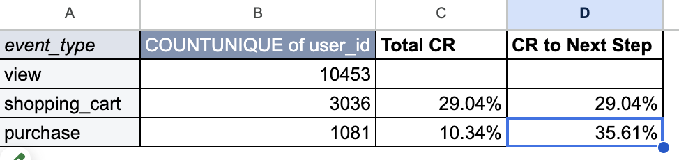
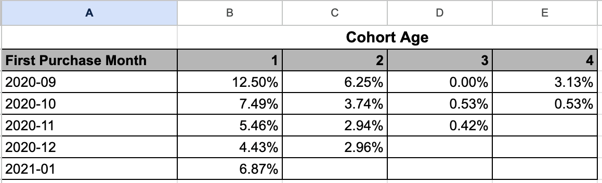

# Website Conversion & Retention Analysis
An Excel-based analysis of website user behavior, focusing on conversion funnels and retention cohorts over a 4-month period (Sep 2020 – Feb 2021). This project provides insights into how users progress through the purchase journey and how retention varies across cohorts.

## Project Overview

- Time Period: Late September 2020 – February 2021
- Data Source: Website activity logs (each row represents a user action)
- Objective: Analyze user behavior to:
- Understand the conversion funnel from site visit to purchase
- Measure cohort-based retention rates

## Key Findings
| Metric | Insight |
| ----------- |----------- |
| Conversion Funnel |	Total site conversion is 10%, but cart-to-purchase conversion is 35%, showing a 25-point jump. Users who pass the initial intent barrier are highly likely to complete a purchase. |
| Retention Rates |	The September 2020 cohort had the highest retention over the 4 months. All cohorts exhibit a gradual daily decay in repeat purchases. |

## Analysis / Methods
| Component |	Description |
|------| ----- |
| Raw Data |	Each row represents a user action, with fields: user ID, event type, and event date. Analysis focuses on these fields to define cohorts and construct conversion funnels. |
| Conversion Funnel |	Two metrics were used:  1. **Total Conversion:** % of unique users reaching a stage from the initial visit  2. **Step-to-Step Conversion:** % of users progressing from one stage to the next |
| Retention Rates |	Cohorts defined by the first purchase month. Monthly retention is calculated as % of users making repeat purchases relative to the original cohort size. |

## Visualizations
### Conversion Funnel
 

### Retention Rates
 

## Next Steps / Recommendations
Based on the patterns observed in the data, the following areas could be explored further:

- **Investigate early funnel drop-off:** While the overall site conversion rate is 10%, users who reach the cart convert at 35%. Further analysis could explore what prevents users from progressing past the initial browsing stage.

- **Test strategies to increase cart engagement:** Since users who add items to their cart are significantly more likely to purchase, improving product discovery, promotions, or call-to-action placement may increase overall conversions.

- **Explore retention initiatives:** Cohort analysis shows consistent decay across time. Businesses may benefit from retention-focused strategies such as loyalty programs, targeted promotions, or follow-up communication with past purchasers.

- **Expand behavioral tracking:** Additional data fields such as session duration, product views, marketing source, or user demographics could provide deeper insight into the drivers of conversion and retention.

## Limitations

- **Limited timeframe:** The dataset covers only a four-month period, which may not fully represent long-term user behavior or seasonal trends.

- **Generalized recommendations:** Because limited contextual information about the business was available, recommendations are based solely on observable data patterns.
